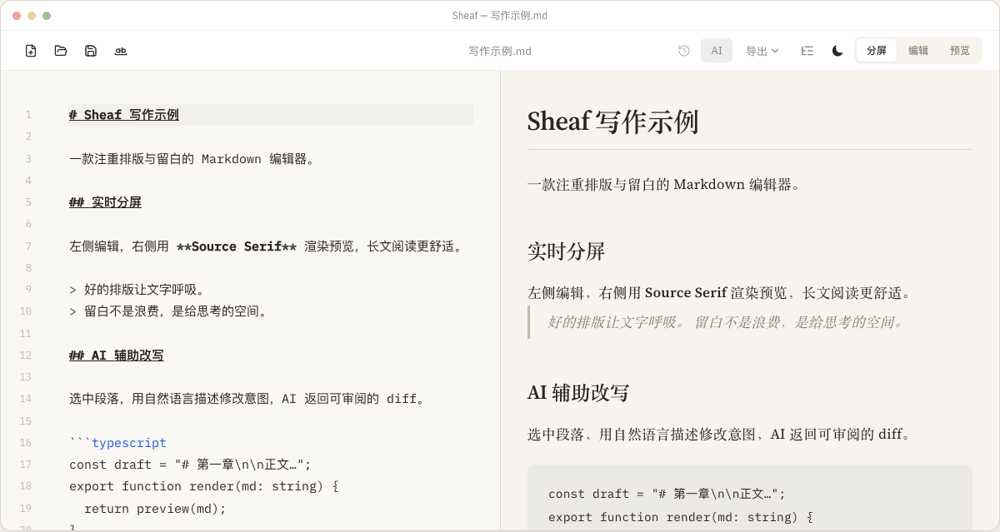
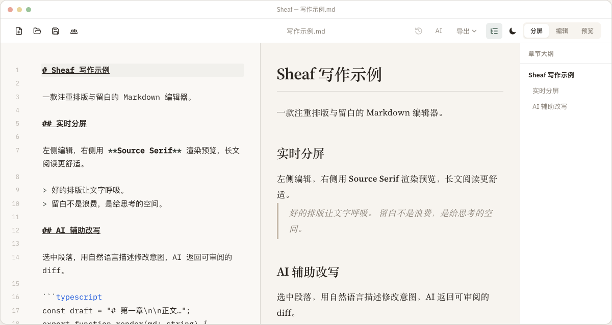
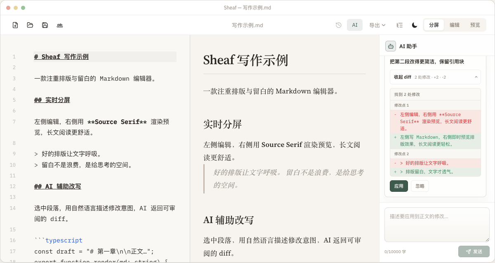
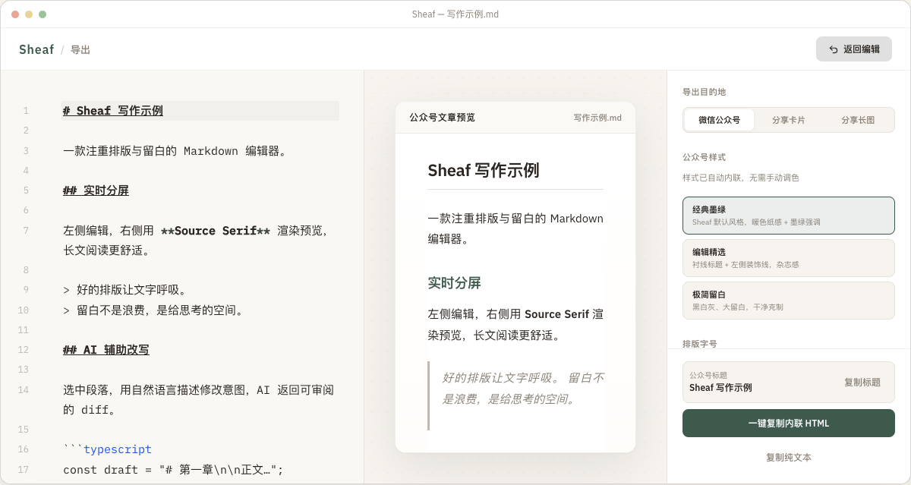

# Sheaf

A local-first Markdown editor for focused writing — split live preview, AI paragraph rewrite, image hosting, and export to PDF & social. Available for macOS and Windows.

Website: [sheaf.reaidea.com](https://sheaf.reaidea.com/) · Download: [Releases](https://github.com/ginuim/Sheaf/releases)

## Screenshots

<p align="center">
  
</p>

<p align="center">
  <strong>Split live preview — monospace editor and serif preview scroll together.</strong>
</p>

| Outline navigation | AI paragraph rewrite |
| --- | --- |
|  |  |

<p align="center">
  
</p>

<p align="center">
  <strong>Export studio — rich HTML for blogs and newsletters, social share cards, and long images.</strong>
</p>

## Features

- **Split live preview** — Monospace editor and serif preview scroll together; split, edit-only, or preview-only views
- **Outline panel** — Auto-generated heading hierarchy with click-to-jump navigation
- **AI paragraph rewrite** — Describe edits in plain language, review the diff, apply in one click; version snapshots before each apply
- **Export** — PDF, rich HTML for blogs and newsletters (Medium, Substack, WordPress, Ghost), social share cards, and long images
- **Image hosting** — Optionally auto-upload inserted images to Qiniu, Aliyun OSS, Tencent COS, or AWS S3
- **Typography** — KaTeX math, Mermaid diagrams, syntax highlighting; automatic CJK spacing
- **Local first** — Documents and settings stay on your disk; no account, no cloud sync

## Tech Stack

| Layer | Stack |
|---|---|
| Desktop | [Tauri](https://tauri.app/) v2 |
| Frontend | Vue 3, TypeScript, Vite |
| Editor | CodeMirror 6 |
| Rendering | markdown-it, KaTeX, Mermaid |

## Requirements

- [Node.js](https://nodejs.org/) (LTS recommended)
- [pnpm](https://pnpm.io/)
- [Rust](https://www.rust-lang.org/) (for desktop builds)

## Quick Start

```bash
pnpm install
```

### Desktop development

```bash
pnpm tauri dev
```

### Website development

```bash
pnpm dev:website
```

### Build

```bash
# Frontend (index.html + website.html)
pnpm build

# macOS installers
pnpm build:mac          # current architecture
pnpm build:mac:arm64    # Apple Silicon
pnpm build:mac:x64      # Intel

# Windows installer
pnpm build:windows
```

## Scripts

| Command | Description |
|---|---|
| `pnpm dev` | Vite dev server for the desktop app (port 1420) |
| `pnpm dev:website` | Vite dev server for the landing page |
| `pnpm build` | Typecheck and build frontend |
| `pnpm preview` | Preview desktop build |
| `pnpm preview:website` | Preview website build |
| `pnpm tauri` | Tauri CLI (`dev` / `build`, etc.) |

## Project Layout

```
├── index.html          # Desktop app entry
├── website.html        # Landing page entry
├── src/
│   ├── main.ts         # Desktop app
│   └── website/        # Landing page, docs, changelog
├── src-tauri/          # Tauri Rust backend
└── markra/             # Reference project (read-only)
```

macOS DMG output: `src-tauri/target/release/bundle/dmg/` (or under the matching target triple).

## Release

Push a version tag to trigger the release workflow:

```bash
git tag v0.1.0
git push origin v0.1.0
```

Or run **Release** manually from GitHub Actions with `tag_name=v0.1.0`.

The workflow builds macOS DMGs (`Sheaf-macos-arm64.dmg`, `Sheaf-macos-x64.dmg`) and Windows installers, then publishes them to [GitHub Releases](https://github.com/ginuim/Sheaf/releases).

Required repository secrets: `APPLE_CERTIFICATE`, `APPLE_CERTIFICATE_PASSWORD`, `KEYCHAIN_PASSWORD`, `APPLE_API_ISSUER`, `APPLE_API_KEY`, `APPLE_API_KEY_PRIVATE_KEY`.

## Development Notes

- Use `pnpm` for package management
- Prefer `@lucide/vue` for icons
- `scripts/` is gitignored (local deploy/nginx helpers); CI does not rely on it

## License

Sheaf is licensed under [AGPL-3.0](LICENSE). You may use, modify, and distribute the source code under the terms of that license, including for commercial purposes. Derivative works must remain open source under the same license.

The **Sheaf** name and logo are trademarks of [reaidea](https://reaidea.com/). Forks must not use these marks to distribute apps on the App Store or other channels in a way that suggests an official product.
