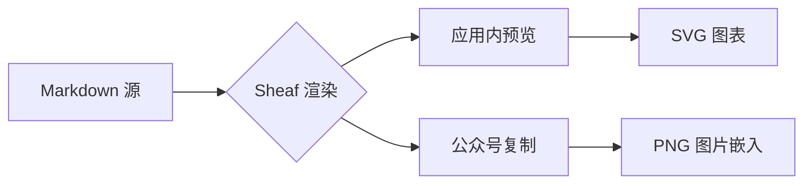
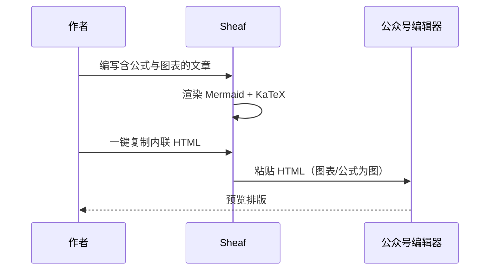
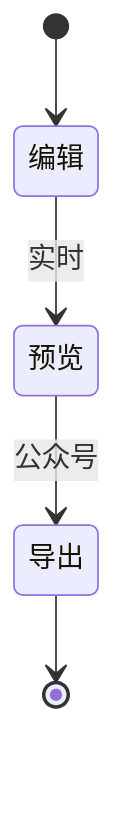
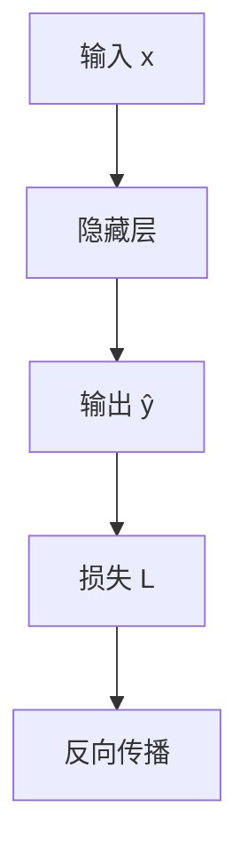

# Mermaid 与公式导出测试

> 用于验证 Sheaf 预览、公众号 HTML 复制、PDF 与卡片导出。保存后打开本文件，切到预览或导出工作室逐项检查。

## 1. 普通排版（对照组）

这是一段普通正文，含 **粗体**、*斜体*、[外链](https://example.com) 和行内 `code`。

- 无序项 A
- 无序项 B

1. 有序第一步
2. 有序第二步

| 列名 | 说明 |
|------|------|
| 预览 | 应正常渲染 |
| 公众号 | 复制后表格边框应保留 |

```javascript
const answer = 42;
console.log("code block", answer);
```

---

## 2. 行内公式

勾股定理：$a^2 + b^2 = c^2$。

欧拉公式：$e^{i\pi} + 1 = 0$。

贝叶斯：$P(A|B) = \dfrac{P(B|A)P(A)}{P(B)}$。

注意：`$20,000` 这类金额不应被当成公式（插件会按 pandoc 规则处理）。

---

## 3. 块级公式

麦克斯韦方程组（块级）：

$$
\begin{aligned}
\nabla \cdot \mathbf{E} &= 4\pi\rho \\
\nabla \times \mathbf{E} + \frac{1}{c}\frac{\partial \mathbf{B}}{\partial t} &= \mathbf{0}
\end{aligned}
$$

二次方程求根：

$$
x = \frac{-b \pm \sqrt{b^2 - 4ac}}{2a}
$$

---

## 4. Mermaid：流程图



---

## 5. Mermaid：时序图



---

## 6. Mermaid：状态图



---

## 7. 图文混排（重点测公众号）

下面这一段同时有行内公式、块级公式和图，**公众号复制**时应把 Mermaid 与公式块变成透明底 PNG，行内公式也会变成小图。

正文：设损失函数 $\mathcal{L} = \sum_i (y_i - \hat{y}_i)^2$，训练流程如下。

$$
\hat{y} = \sigma(Wx + b)
$$



**检查清单**

- [ ] 主编辑器预览：Mermaid 为图，公式有正确字体
- [ ] 导出工作室 → 微信公众号：预览区图表可见
- [ ] 一键复制 HTML：粘贴到公众号后台，图与公式不丢
- [ ] 暗色主题下 Mermaid 线条/文字仍可读
- [ ] PDF 导出：Mermaid 能出现在打印预览

---

*测试完成可删除本文件，或保留作回归样例。*
